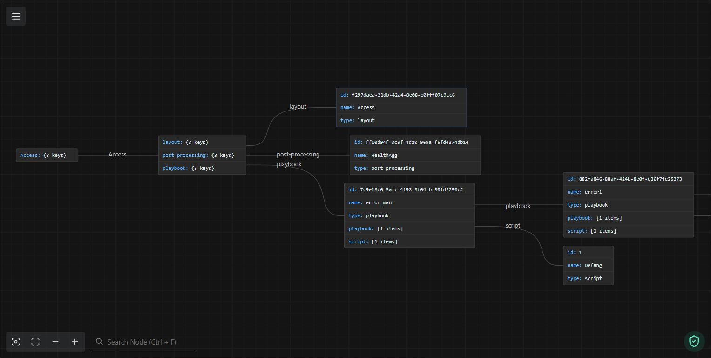

<p align="center"><a href="img/icon.png"></a></p>

<h1 align="center">XSOAR Visualizer</h1>

<p align="center">Visualize XSOAR content bundles as intuitive, interactive graphs.</p>
<p align="center">
	

  <a href="https://github.com/mandarnaik016/XSOAR-Visualizer/blob/main/LICENSE" target="_blank">
    
  </a>
</p>

## :sunglasses: What's XSOAR Visualizer?
XSOAR Visualizer converts exported Cortex XSOAR content bundles into insightful graphs for navigating a specific use case. The tool uses the incident type as a starting point and lists the associated layout, playbook, and post-processing for that type. It then analyzes the attached playbook, scanning the content bundle for referenced custom scripts and sub-playbooks to generate a comprehensive graphical representation.

## :astonished: Why XSOAR Visualizer?
The last time I opened yet another XSOAR environment, I was greeted by chaos: playbooks nested inside playbooks, ten levels deep—plunging straight to the ocean floor. A single modification to a custom script was enough to send entire chains of playbooks into error states, collapsing the automation like a house of cards.

## Install

```sh
git clone git@github.com:mandarnaik016/XSOAR-Visualizer.git
```

## Usage

1. Extract the contents of `content-bundle-*.tar.gz` to folder **ContentBundle**.
2. Run `python main.py`.
3. Enter incident type name.
4. Load the generated `outputs.json` in [jsoncrack](https://jsoncrack.com/editor).

## Result

<p align="center"><a href="img/result.png"></a></p>

## Todo

- [ ] Add custom file path of content bundle as input.
- [ ] Add custom incident fields used within layout to graphs.

## Author

👤 **Mandar Naik**

- Website: https://mandarnaik016.github.io/
- Twitter: [@_md_naik](https://twitter.com/_md_naik)
- Github: [mandarnaik016](https://github.com/mandarnaik016)
- LinkedIn: [mandarnaik016](https://linkedin.com/in/mandarnaik016)

## :open_hands: Contributing

Contributions, issues and feature requests are welcome!<br />Feel free to check [issues page](https://github.com/mandarnaik016/XSOAR-Visualizer/issues).

## :heart: Show your support

Give a ⭐️ if this project helped you!

## 📝 License

Copyright © 2026 [Mandar Naik](https://github.com/mandarnaik016).<br />
This project is [GPL v3](https://github.com/mandarnaik016/XSOAR-Visualizer/blob/main/LICENSE) licensed.